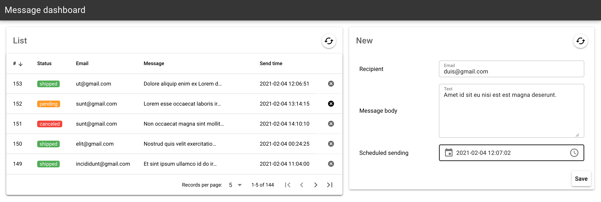

The microservice is part of the application [Message](https://github.com/pvelx/k8s-message-demo).
---

Admin panel for managing deferred message sending. It is written on the basis of the Vue framework.

### License

This project is licensed under the MIT License - see the [LICENSE](LICENSE) file for details

